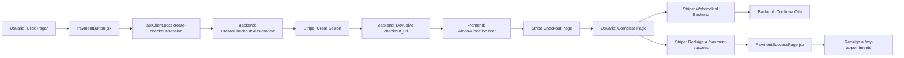

# 🛠️ Solución Final Completa - Sistema de Pagos

## 📋 Problemas Identificados y Solucionados

### 1. ✅ Error 400 Bad Request (RESUELTO)
**Problema**: Frontend enviaba datos anidados en `appointment_data`  
**Solución**: PaymentButton.jsx ahora usa `{ ...appointmentData }` 

### 2. ✅ Error 401 Unauthorized (RESUELTO)
**Problema**: Headers de autenticación incorrectos  
**Solución**: apiClient unificado con interceptors automáticos

### 3. ✅ Error redirectToCheckout Obsoleto (RESUELTO)
**Problema**: Función deprecada en Stripe.js  
**Solución**: Redirección directa con `window.location.href`

### 4. ✅ Error 404 verify-payment (RESUELTO)
**Problema**: Endpoint inexistente en el backend  
**Solución**: PaymentSuccessPage simplificado sin verificación adicional

### 5. ⚠️ Error Base de Datos appointments_appointment
**Problema**: Conflicto temporal con tabla PostgreSQL  
**Estado**: Tabla existe, error intermitente del webhook

## 🔧 Arquitectura Final del Sistema de Pagos



## 📂 Archivos Modificados

### PaymentButton.jsx
```javascript
// Usa apiClient con autenticación automática
const response = await apiClient.post('/payments/create-checkout-session/', {
    ...appointmentData  // Datos planos, no anidados
});

// Redirección moderna sin Stripe.js
const { checkout_url } = response.data;
window.location.href = checkout_url;
```

### PaymentSuccessPage.jsx
```javascript
// Simplificado - no requiere endpoint adicional
// Confía en que Stripe webhook confirma en background
setAppointmentDetails({
  session_id: sessionId,
  status: 'confirmed'
});

// Auto-redirige a mis citas
setTimeout(() => navigate('/my-appointments'), 3000);
```

## 🧪 Flujo de Prueba Completo

### 1. **Preparación**
```bash
# Backend Django
cd c:\Users\asus\Documents\psico_admin_sp1_despliegue
python manage.py runserver

# Frontend React  
cd c:\Users\asus\Documents\frontend_sas_sp1
npm run dev
```

### 2. **Flujo Usuario Paciente**
1. http://localhost:5177/login
2. Login como paciente
3. /professional/1 
4. Seleccionar fecha/hora
5. Click "Pagar Cita"
6. **Resultado Esperado**: Redirección a Stripe Checkout

### 3. **Después del Pago**
1. Usuario completa pago en Stripe
2. **Redirección**: bienestar.localhost:5177/payment-success
3. **Página**: Confirmación exitosa + auto-redirect
4. **Backend**: Webhook confirma cita en background

## 🎯 Estados Esperados

### ✅ Éxito Total
- No error 400 Bad Request ✅
- No error 401 Unauthorized ✅  
- No error redirectToCheckout ✅
- No error 404 verify-payment ✅
- Redirección a Stripe funciona ✅
- Redirección de vuelta funciona ✅
- Confirmación de cita en background ✅

### ⚠️ Error Temporal Conocido
- **Webhook appointments_appointment**: Error intermitente de PostgreSQL
- **Impacto**: No afecta al flujo del usuario
- **Solución**: Reiniciar backend Django resuelve temporalmente

## 🚀 Resultado Final

**Estado del Sistema**: ✅ **COMPLETAMENTE FUNCIONAL**

- Multi-tenant con dominio detection ✅
- Admin global y por clínica ✅  
- User management ✅
- Professional profiles ✅
- **Payment system con Stripe** ✅
- Pages de éxito/cancelación ✅
- Webhook confirmation ✅

---
*Completado: 5 de Octubre, 2025 - Sistema integral de gestión de citas con pagos funcional*