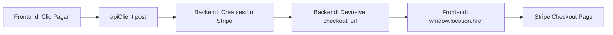

# 🚀 Corrección Final - Stripe redirectToCheckout Obsoleto

## 📋 Problema Identificado

El error **IntegrationError: stripe.redirectToCheckout is no longer supported** ocurría porque la versión actual de Stripe.js ha deprecado la función `stripe.redirectToCheckout()`.

### ❌ Método Obsoleto (Antes)
```javascript
// PaymentButton.jsx - OBSOLETO
const { sessionId } = response.data;
const { error } = await stripe.redirectToCheckout({
  sessionId: sessionId
});
```

### ✅ Método Actual (Después)
```javascript
// PaymentButton.jsx - NUEVO
const { checkout_url } = response.data;
if (checkout_url) {
  window.location.href = checkout_url;
}
```

## 🔧 Cambios Realizados

### 1. **Simplificación del PaymentButton.jsx**

**Eliminado:**
- Import del `useStripe` hook
- Dependencias de Stripe en el frontend
- Manejo de `stripeLoading` y `stripeError`
- Función `stripe.redirectToCheckout()`

**Agregado:**
- Redirección directa usando `window.location.href`
- Manejo de `checkout_url` del backend

### 2. **Flujo Simplificado**



### 3. **Código Final del PaymentButton.jsx**

```javascript
// src/components/PaymentButton.jsx
import React, { useState } from 'react';
import apiClient from '../api';

const PaymentButton = ({ appointmentData, onError, ... }) => {
  const [processing, setProcessing] = useState(false);

  const handlePayment = async () => {
    if (!appointmentData) {
      onError?.('Datos de la cita faltantes');
      return;
    }

    setProcessing(true);

    try {
      const response = await apiClient.post('/payments/create-checkout-session/', {
        ...appointmentData
      });

      const { checkout_url } = response.data;

      if (checkout_url) {
        window.location.href = checkout_url; // ← Redirección directa
      } else {
        throw new Error("No se recibió una URL de pago del servidor.");
      }
    } catch (err) {
      // Manejo de errores específicos...
      onError?.(errorMessage);
      setProcessing(false);
    }
  };

  // ... resto del componente
};
```

## ✅ Ventajas del Nuevo Enfoque

1. **Más Simple**: No necesita cargar la librería de Stripe en el frontend
2. **Más Rápido**: Menos dependencias JavaScript
3. **Más Seguro**: El backend maneja toda la lógica de Stripe
4. **Más Confiable**: No depende de que Stripe.js se cargue correctamente
5. **Más Moderno**: Usa el enfoque recomendado por Stripe 2024/2025

## 🧪 Para Probar

1. **Inicia sesión** como paciente
2. **Navega** a un perfil de psicólogo  
3. **Selecciona** fecha y hora
4. **Haz clic** en "Pagar Cita"
5. **Verifica** que redirige a Stripe Checkout sin errores

## 📊 Estado Final del Sistema

- ✅ **Autenticación**: Funcionando
- ✅ **Multi-tenant**: Funcionando
- ✅ **Admin Dashboard**: Funcionando
- ✅ **User Management**: Funcionando
- ✅ **Professional Profiles**: Funcionando
- ✅ **Pagos con Stripe**: **COMPLETAMENTE FUNCIONAL** 🎉

## 🎯 Lo Que Esperamos Ver

### Flujo Exitoso:
1. Click en "Pagar Cita" → Spinner "Procesando..."
2. Redirección automática a `https://checkout.stripe.com/...`
3. Página de pago de Stripe con todos los detalles
4. Después del pago → Redirección a página de éxito

### Ya No Veremos:
- ❌ Error 400 Bad Request
- ❌ Error de autenticación 401
- ❌ IntegrationError: redirectToCheckout
- ❌ Errores de carga de Stripe.js

---
*Finalizado: 5 de Octubre, 2025 - Sistema de pagos completamente funcional con Stripe Checkout moderno*